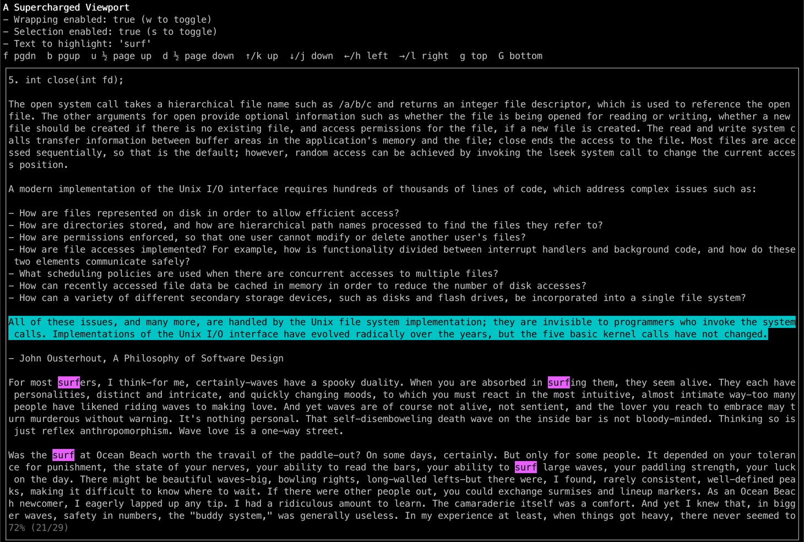

# Bubbleo

Custom components for [Bubble Tea](https://github.com/charmbracelet/bubbletea), akin to https://github.com/charmbracelet/bubbles.

Currently contains a viewport with some nice features like:

* navigation
* optional text wrapping
* optional line selection
* text highlighting

Inspired by the viewport used in [Wander, a terminal app for HashiCorp Nomad](https://github.com/robinovitch61/wander).
